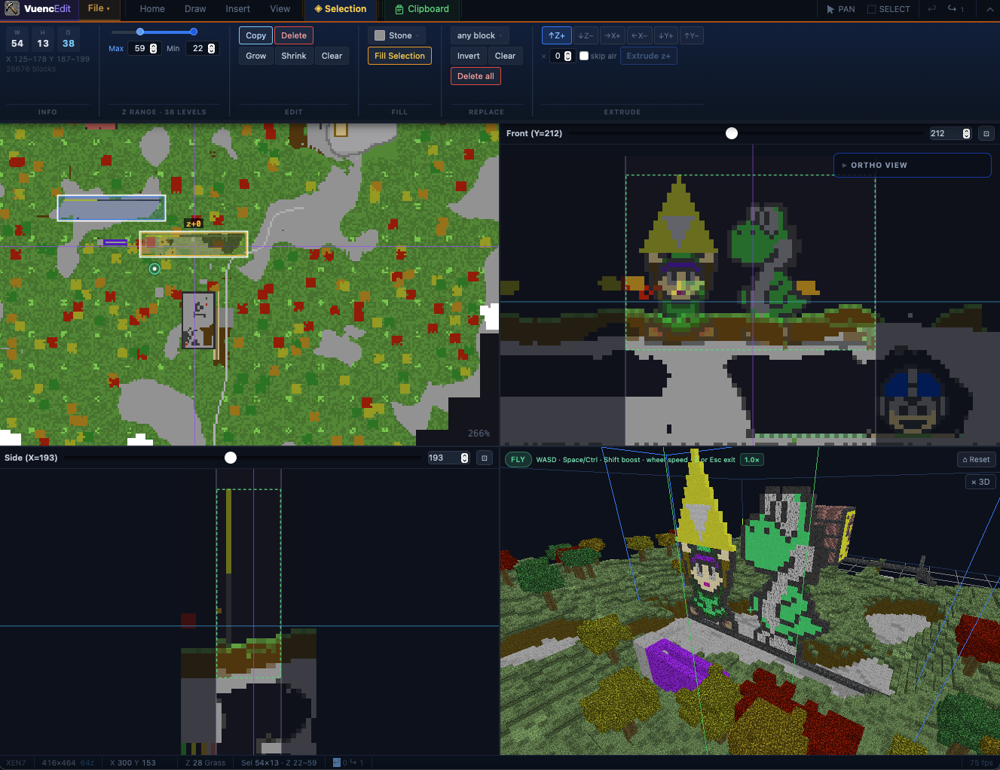

<p align="center">
  
</p>

# VuencEdit

A map viewer and block editor for **Eden World Builder** world files (`.eden`).

Open a world file and get a colour-coded top-down map of everything in it. Pan and zoom around, select regions, fill or replace blocks, copy and paste structures, generate whole new worlds from scratch, and save your changes back — all without touching the game itself.

Based on Eden World Manipulator, which is itself based on Vuenctools. Original file format documentation by Robert Munafo.

Eden World Builder was created by Ari Ronen and made open source in 2018.

For support, visit the [Discord server](http://discord.gg/rjYXwBC) for the game and community.

---

## Downloads

Pre-built installers for macOS (Apple Silicon + Intel universal), Windows, and Linux are on the [Releases](../../releases) page.

---

## Screenshot

<p align="center">
  
</p>

---

## What it does

### Interface
- **Ribbon toolbar** — a tabbed, collapsible toolbar (Home / Selection / View / File) replaces the old menu bar; resizable height, persisted between sessions, with an app menu for settings, help, and about
- **Right-click context menu** — right-click anywhere on the map for quick actions: set spawn here, copy, paste here, fill/delete/clear selection, teleport the 3D camera, and tool switching
- **Settings** — persistent app preferences (default quad view, default 3D pane, default save compression, template path, texture-pack path)

### Viewing & navigation
- **Zoomable, pannable top-down map** of any Eden world file
- **Z-slice mode** — step through horizontal layers one at a time with a slider
- **Axonometric (axo) view** — isometric-style perspective with an adjustable depth skew
- **Full map mode** — renders the entire world into a single canvas for lag-free pan/zoom
- **Quad view** — a Hammer/Radiant-style four-pane editor: top-down map + front and side slice/ortho viewports + a live 3D pane, with movable cut-planes, marquee selection, and in-viewport drawing
- **3D fly-through** — a streaming Three.js view of the whole world; orbit with the mouse or press **Z** for WASD free-look flight; the camera position is shown as a dot on the top-down map and can be teleported by click or via the right-click menu
- **Elevation preview panel** — resizable front and side cross-section of the current selection, with optional draw support

### Selecting & inspecting
- **Click-drag selection** with Z-range controls
- **Magic Wand** — click any surface block to flood-select the contiguous region sharing that block type (or block+paint combination)
- **Selection inspector** — dimensions, block counts, orthographic previews
- **3D view** — on-demand Three.js 3D render of any selection up to 64×64×64

### Editing
- **Fill / replace / delete** — fill a region with any block, replace one material with another, or selectively delete blocks with an optional filter
- **Draw tools** — Pen, Brush, Rectangle, and Ellipse paint blocks directly on the map; brush size (1/3/5/7/9) and shape (square/circle), plus fill/hollow rect and ellipse
- **Draw mask** — restrict painting to cells whose current block type (and optionally paint) matches a chosen target
- **Hotbar** — 5 pinned + 5 recent block+paint combos for fast switching; hover a recent swatch to pin it
- **Undo / redo** with multi-level history and a 256 MB budget cap

### Copy, paste & prefabs
- **Copy / paste** any volume; paste with optional *No Air*, *Terrain-align*, *Rotate 90°*, *Flip X/Y*, and *Repeat* modes
- **Two-click paste lock-in** — first click locks XY position (amber ghost + elevation preview), second click places; Escape unlocks without placing
- **Advanced paste** — *scatter* (N randomly placed copies) and *array* (a rows × columns grid with configurable spacing)
- **Save prefab** — save any selection as a `.epfab` file and reload it later; prefabs are gzip-compatible
- **Extrude** — repeat a selection N times along any of 6 axes in one undo step

### Texture packs *(experimental)*
- **Load a ZIP of PNG block textures** to give the 3D views (fly-through + selection preview) and block-picker swatches real textures; the 2D top-down map stays flat-colour. Textures are converted to greyscale and tinted by each block's natural or painted colour, so one pack works across every paint variant

### World generation
- **New World dialog** with four terrain tabs:
  - **Flat** — fixed-height world with configurable stone/dirt layers
  - **Natural (Procedural)** — full biome pipeline with domain-warped continents, mountain ridges, erosion (flat plains alternating with rugged highlands), rivers, lakes/ocean, caves, ores, trees, structures, and clouds; single or mixed biomes (Grassland / Desert / Snow / Lava / Classic+) with speckled dither at biome edges; live terrain preview
  - **Classic** — faithful port of the original legacy generator (seeded Perlin noise, hand-carved cave + skin passes, sparse flower/weed mix to avoid the game's sprite-buffer crash)
  - **Tg2** — port of the Eden 2.0 TerrainGen2 generator with 9 terrain types (Plains, Mars, RiverForest, Mtn+River, Desert, Ponies, Beach, Mix, Flat) plus sky islands, structures, amplitude and sea-level knobs, noise-warped seam blending; live terrain preview reflecting amplitude, sea level, and height format
- **64z (Legacy)** and **256z (New Dawn)** height formats for all generators

### File & server
- **Compressed world support** — reads and writes `.eden.zip` (deflate-9) alongside plain `.eden`
- **Browse Worlds** — search and download any world from the Eden community servers with preview images, date range filters, quality sorting, and a *Hide junk* toggle
- **Upload** — share your world back to the Eden servers with a PNG thumbnail
- **OBJ export** *(experimental)* — export a selection or the whole world as a Wavefront OBJ + MTL file with face-culled geometry and per-block materials; ramps and wedges export as correct prism/pyramid geometry
- **Schematic import** — import Minecraft `.schematic` and `.litematic` builds with a block-mapping table, colour-substrate selector, preset save/load, and a top-down preview before applying
- **Template overlay** *(experimental)* — sparse worlds (which only store edited chunks) leave gaps in the top-down map; point VuencEdit at the game's bundled `Eden.eden` pre-generated template to render the surrounding terrain faded behind your edits. PNG exports bake the template at full opacity where your world has no chunks
- **Expand from Template** *(experimental)* — fill a sparse world out to the full template extent (or just within its current bounds), writing all the missing terrain chunks into a new world file

---

## Building from source

### Prerequisites

| Tool | Version |
|------|---------|
| [Rust](https://rustup.rs) | stable (1.77+) |
| [Node.js](https://nodejs.org) | 18 LTS or newer |

**Linux only** — also install the WebKit development libraries:

```bash
sudo apt-get install libwebkit2gtk-4.1-dev libappindicator3-dev librsvg2-dev patchelf
```

### Run in development

```bash
npm install
npm run tauri dev
```

### Build a release binary

```bash
npm run tauri build
```

The compiled app and installers appear in `src-tauri/target/release/bundle/`.

---

## Usage

Most actions live on the **Ribbon** — a tabbed toolbar (Home / Selection / View / File) pinned below the title bar. The steps below refer to those tabs.

1. **Open a world** — click *Open Local File* on the welcome screen, or use the **File** tab → *Open*. On macOS, worlds are usually in `~/Library/Containers/com.manomio.eden/Data/Documents/worlds/`.
2. **Browse Worlds** — click *Browse Worlds* on the welcome screen (or **File** tab → *World Browser*) to search the Eden community servers. Pick a result and click **Save & Open** to download and open it immediately.
3. **Create a new world** — **File** tab → *New World* opens the generation dialog. Choose a terrain tab, configure options, preview the result, and click Create.
4. **Navigate** — scroll to zoom; middle-click-drag or the Pan tool to move. Press **Home** or *Fit Map* to zoom to the whole world.
5. **Select a region** — pick the Select tool on the **Home** tab, then click-drag a rectangle. Adjust the Z range in the inspector panel, or use the Magic Wand (**W**) to flood-select matching blocks.
6. **Inspect** — the floating inspector shows dimensions, block counts, and orthographic previews of the selection. Click **3D VIEW** to render a Three.js preview.
7. **Edit** — with a selection active, use the **Selection** tab (or the right-click menu) to fill, replace, or delete blocks.
8. **Generate trees** — with a selection active, expand the **TREES** section in the inspector to place deciduous, terrain, pine, or tall-pine trees at a given density.
9. **Extrude** — expand the **EXTRUDE** section to repeat the selection along an axis.
10. **Copy / paste** — Copy captures the selection. Switch to Paste and click to place. Use the **Selection** tab toggles for *No Air*, *Terrain*, *Rotate 90°*, *Flip X/Y*, and *Repeat*; expand **Advanced paste** for scatter and array modes.
11. **Draw** — activate a draw tool (Pen / Brush / Rect / Ellipse) from the **Home** tab or keyboard. Pick a block from the hotbar or the picker. Enable *Mask* to restrict painting to a specific block type.
12. **Quad view** — **View** tab → *Quad View* opens the four-pane editor (top-down + front/side slices + 3D). Drag the violet cut-lines to move the slice planes; left-drag in a slice with the Select tool to marquee-select; draw directly in a slice with any draw tool.
13. **3D fly-through** — in quad view, toggle the **3D Pane** on (**View** tab). Orbit with the mouse, or hover the pane and press **Z** for WASD free-look flight (Space/E up, Ctrl/Q down, Shift to boost, wheel to change speed; Esc or Z to exit).
14. **Elevation panel** — enable in the inspector to see a front/side cross-section of the selection. Clicking in the panel places blocks at the exact Z level you click.
15. **Axo view** — **View** tab → render mode *Axo* switches to an isometric perspective; drag the Skew slider to change it.
16. **Texture pack** — **View** tab → *Texture Pack* → Load a ZIP of block PNGs to texture the 3D views and picker swatches.
17. **Template overlay** — **View** tab → *Template Overlay* → point at the game's `Eden.eden` file to show surrounding terrain behind a sparse world. **File** tab → *Expand from Template* bakes that terrain into a new world file.
18. **Import Schematic** — **File** tab → *Import Schematic* lets you bring in a Minecraft build, remap blocks, and paste it in.
19. **Export** — **File** tab → *Export* writes PNG, OBJ (+MTL), or JSON. OBJ/JSON export the current selection if one is active, otherwise the full world.
20. **Save** — *Save* writes changes to the original file in place. *Save As* writes to a new file. Toggle *Compressed* to write a `.eden.zip`.
21. **Upload** — **File** tab → *Upload* lets you share the current world to the Eden servers. A PNG thumbnail is required.
22. **Right-click** — right-click the map for a context menu: set spawn here, copy, paste here, fill/delete/clear selection, teleport the 3D camera, and quick tool switches.

### Keyboard shortcuts

| Key | Action |
|-----|--------|
| Scroll | Zoom in / out |
| Middle drag | Pan |
| Home | Zoom to fit |
| Escape | Clear selection / exit paste / exit draw tool |
| Cmd/Ctrl+Z | Undo |
| Cmd/Ctrl+Shift+Z or Y | Redo |
| Z | Enter / exit 3D fly mode (while hovering the 3D pane) |
| WASD / Space / Ctrl | Move while in fly mode (Shift to boost) |
| P | Pen draw tool |
| B | Brush draw tool |
| R | Rectangle draw tool |
| E | Ellipse draw tool |
| W | Magic Wand tool |
| ? | Keyboard shortcut reference |

---

## Technical overview

VuencEdit is built with [Tauri 2](https://tauri.app) — a Rust backend exposed to a React / TypeScript frontend rendered in the system WebView.

### Why Tauri + Rust

Eden world files use a dense binary format with band-addressed block data:

```
addr + band × 8192 + x × 256 + y × 16 + z        → block type
addr + band × 8192 + x × 256 + y × 16 + z + 4096 → paint byte
```

Parsing and rendering this in JavaScript requires large `ArrayBuffer` operations that balloon V8 heap. Rust handles all byte-level arithmetic with explicit endianness, and `mmap` (MAP_PRIVATE) pages world data in on demand — keeping RSS around 37 MB even for 1+ GB world files.

### Project layout

```
src/
  App.tsx                    — state, keyboard shortcuts, orchestration
  Ribbon.tsx                 — tabbed Ribbon toolbar (Home / Selection / View / File)
  MapCanvas.tsx              — Canvas: tiled rendering, pan/zoom/select/paste/draw input, right-click menu
  SelectionInspector.tsx     — floating stats + orthographic preview + extrude + trees + 3D view
  ElevationPreviewPanel.tsx  — resizable front/side elevation cross-section, draw support
  ThreeDPreview.tsx          — on-demand Three.js 3D render of the current selection
  FlyView3D.tsx              — streaming fly-through 3D pane (quad view)
  SliceViewport.tsx          — front/side slab + ortho viewports for quad view
  texturePack.ts             — texture-pack atlas decoder + tinted picker swatches
  BlockPaintPicker.tsx       — reusable block + paint picker (fill / filter modes)
  WorldBrowserModal.tsx      — search/download worlds from Eden servers
  UploadModal.tsx            — upload world + thumbnail to Eden server
  NewWorldModal.tsx          — new world dialog (Flat / Natural / Classic / Tg2 tabs)
  SchematicImportModal.tsx   — Minecraft .schematic/.litematic import with block mapping
  SettingsModal.tsx          — persistent app settings
  HelpModal.tsx              — shortcuts + texture-pack help
  ErrorBoundary.tsx          — inline error fallback wrapping the quad-view panes
  drawTools.ts               — geometry helpers (penFootprint, brushFootprint, Bresenham line, rect, ellipse)
  blockDefs.ts               — block type registry, display colours, ramp/wedge helpers
src-tauri/src/
  lib.rs                     — world parser, all Tauri commands, colour tables, terrain generators
  texturepack.rs             — texture-pack loader: atlas builder, per-face tile mapping
EdenWorldManipulator2.0/     — reference C# implementation (source only)
MROB.txt                     — file format reverse-engineering notes
```

### IPC

Pixel buffers cross the JS↔Rust boundary as base64-encoded binary (custom `serde` serialiser), cutting JS heap usage ~8× versus JSON number arrays. Edit commands return only the changed rectangle (`EditResult { patch: PixelPatch }`), so large worlds don't retransmit unchanged data.

### Rendering

Three render modes share the same canvas:

- **Tiled (default)** — 512-pixel tiles fetched on demand, up to 4 in-flight IPC requests, prioritised by distance from the viewport centre.
- **Full Map** — entire world streamed into a single offscreen canvas in 128-pixel strips; a progress bar tracks loading.
- **Axo View** — same offscreen canvas, loaded via `render_axo_region` strips; each edit forces a full reload.

### 3D

The selection 3D preview and the fly-through pane both build Three.js geometry from face-culled cubes (plus prisms for ramps and pyramids for wedges) generated in Rust, with directional shading baked into vertex colours so the scene needs no lights. The fly-through streams per-chunk meshes within a load radius around the camera, disposing distant chunks, with adaptive request concurrency that drops while flying to avoid frame hitches. Optional texture packs supply greyscale tile detail multiplied by each block's colour on the GPU.

### Undo / redo

Chunk-scoped snapshots: only chunks touched by an edit are copied before the change. A 256 MB byte-budget cap evicts the oldest entries first. Chunks whose bytes are unchanged after an edit are dropped before the snapshot is pushed.

### World generation

Three procedural generators live in `lib.rs`:

- **Natural** — a whole-world pipeline (not per-chunk) so trees, structures, and clouds span chunk borders without grid artefacts. Heightmap: domain-warped 6-octave FBM continents + ridged mountain peaks + optional erosion field (reduces relief amplitude in high-erosion regions, creating Minecraft-style flat-plain / highland alternation). Biome assignment uses per-column climate jitter (BIOME_DITHER=0.16) to speckle edges. Decoration: trees, cacti, flowers, weeds flush with surface, boulders, structures (cabin/well/watchtower/ruins/pyramid), clouds.
- **Classic** — faithful port of the original legacy generator using seeded Ken-Perlin noise with the same block IDs and cave passes as the shipped game.
- **Tg2** — port of the Eden 2.0 TerrainGen2 generator. Uses an intermediate flat workspace (`Tg2Grid`) so biome passes can read back already-placed blocks. Zone seams use a smoothstep + noise-warped `tg2_make_transition`; the `blend` post-pass bidirectionally blurs natural-terrain surface heights with a noise-warped box-blur kernel and hash-dithers palette seams.

### File format

Two chunk layouts are supported: standard (32 768 B / 64 z-levels) and extended (131 072 B / 256 z-levels). Compressed worlds (deflate zip) are detected by PK magic, decompressed to a temp file, and mmapped. The format is documented in `MROB.txt` and cross-referenced against the reference C# implementation in `EdenWorldManipulator2.0/`.

### Automated releases

Pushing a `v*` tag triggers a GitHub Actions workflow that builds macOS (universal binary), Windows, and Linux installers in parallel and publishes them as a draft GitHub Release.
