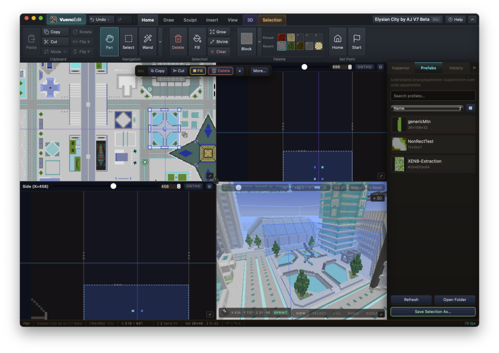

<p align="center">
  
</p>

# VuencEdit

**[hagg3.github.io/VuencEdit](https://hagg3.github.io/VuencEdit/)**

VuencEdit is a desktop editor for **Eden World Builder** world files (`.eden`). Open a world and you
get a top-down map of the whole thing, which you can pan around, select, paint, sculpt, copy from and
paste into. You can also fly through the world in 3D, generate new worlds from scratch, and save
everything back to a file the game will load. It runs on macOS, Windows and Linux, and never touches
the game itself.

It started as a successor to Eden World Manipulator, which was itself based on Vuenctools. The file
format was originally documented by Robert Munafo. Eden World Builder was made by Ari Ronen and
open-sourced in 2018.

Questions, bug reports and screenshots of cool builds are all welcome on the game's
[Discord server](http://discord.gg/rjYXwBC).

<p align="center">
  
</p>

## Download

Installers for macOS (universal), Windows and Linux are on the [Releases](../../releases) page.

On macOS the game keeps its worlds in
`~/Library/Containers/com.manomio.eden/Data/Documents/worlds/`. You can also skip that and grab
worlds straight from the community servers with **Browse Worlds** on the welcome screen.

## What you can do with it

**Look around.** The map is colour-coded by block and paint and stays smooth on very large worlds.
Z-Slice shows one layer at a time, and Cutaway hides everything above a height you pick, so you can
see into caves and buildings. Drawing, sculpting and the eyedropper all work on whatever surface is
exposed. A 3D view floats over the map as a window: you can orbit, fly, or use Minecraft-style
mouselook (press **Z** over it to cycle modes), and ⇄ or Tab swaps it with the map so 3D becomes the
main view. You can break, place, select and sculpt directly in 3D. Night lighting, sun shadows, a
GPU shadow mode, sky colours and texture packs are all optional and off by default where they cost
performance.

**Select and edit.** Drag a box, draw a lasso or polygon, or use the Magic Wand to grab every
connected block of one type. Fill, replace or delete inside a selection, with block and paint
filters. The draw tools cover pen, brush, spray, line, rectangle, ellipse and polygon, plus gradient
fills and a draw mask that only paints over a chosen block. The Hotbar window keeps five pinned and
five recent blocks on the number keys. Everything goes through undo/redo, and a long sculpt or spray
stroke undoes as a single step.

**Sculpt terrain** *(experimental)*. There are 16 brush tools: Raise, Lower, Grab, Smooth,
Flatten, Slope, Noise, Erode, Thermal, Hydro, Stamp, Terrace, Sharpen, Smear, Rock and Carve. They
have soft falloff, hold-to-build, and modifier keys (hold Ctrl/⌘ to invert, Shift to smooth, `[` `]`
for size). They work on the map and in the 3D view.

**Copy, paste and prefabs.** Copy any volume, then rotate, mirror, skip air or conform it to the
terrain while pasting. You can also scatter copies at random or lay them out in a grid. While a paste
is armed, a small **paste lens** window shows front and side views of where it will land, with
buried blocks marked in red. You can save selections as prefabs and paste them back later from the
Prefab Library. Extrude repeats a selection along any axis.

**Make new worlds.** New World has four generators. **Flat** is a blank slab. **Natural** has
biomes, rivers, caves, ores, trees and structures. **Classic** is a faithful port of the game's
original generator. **Tg2** is a port of Eden 2.0's TerrainGen2. Natural and Tg2 show a live
preview. All four can write either the legacy 64-high format or the newer 256-high one.

**Files and servers.** VuencEdit reads and writes plain `.eden` files and compressed `.eden.zip`
files. Saves are atomic, so a crash or power cut mid-save can't damage your world. It also keeps a
recovery journal while you work. You can browse, search and download worlds from the Eden
community servers, upload your own with a thumbnail, and export the map as a PNG. For sparse worlds,
the game's bundled `Eden.eden` template can be drawn behind your edits, or baked into the world to
fill it out *(experimental)*.

Most of this lives on the ribbon (Home, Selection, Clipboard, Draw, Sculpt, Insert, View and 3D).
If you can't find something, press **⌘K** (**Ctrl+K** on Windows/Linux) and type what you're
after. It searches every command and shows where each one lives and its shortcut. **?** opens the
full shortcut list.

## Something went wrong?

If it's slow, crashes or draws something odd (especially in the 3D view), open
**Help ▸ Diagnostics…**, click **Refresh**, then **Copy to clipboard** or **Save as .txt…**. Post
that along with what you were doing on [Discord](http://discord.gg/rjYXwBC) or in a GitHub issue.
The report covers memory use, your GPU, and loading/frame timings. It doesn't include your folders or
world contents, and nothing is sent anywhere unless you post it yourself. If the problem is in 3D,
turning on **Settings ▸ 3D performance HUD** before you reproduce it adds a live readout to the pane.

## Building it yourself

You'll need [Rust](https://rustup.rs) (stable) and [Node.js](https://nodejs.org) 18 or newer. On
Linux you also need the WebKit libraries:

```bash
sudo apt-get install libwebkit2gtk-4.1-dev libappindicator3-dev librsvg2-dev patchelf
```

Then:

```bash
npm install
npm run tauri dev     # run with hot reload
npm run tauri build   # installers end up in target/release/bundle/
```

Pushing a `v*` tag builds all three platforms on GitHub Actions and publishes a draft release.

## How it works

VuencEdit is a [Tauri 2](https://tauri.app) app, with a Rust backend and a React/TypeScript
frontend. The map is drawn on an HTML canvas and the 3D view uses Three.js.

The Rust side does all the heavy work. It parses the world, renders map tiles, meshes 3D chunks,
generates terrain, and applies edits and undo. Eden worlds can run to several gigabytes, so
nothing loads the whole file into memory. VuencEdit works on a private copy of the world, maps it
from disk, and only reads the chunks it needs. Image and mesh data reach the frontend as raw binary
rather than JSON. Undo stores compressed per-chunk differences under a memory budget you can set in
Settings. The pure voxel code (colours, rendering, meshing, lighting) lives in a separate
`voxel-core` crate, which Eden's multiplayer companion app VuencLink also uses.

The file format notes are in `MROB.txt`, and `EdenWorldManipulator2.0/` holds the C# reference
implementation everything was checked against. The `DOCUMENTATION/` folder has the long version:
file format, rendering, editing and undo, and a reference for every backend command.
